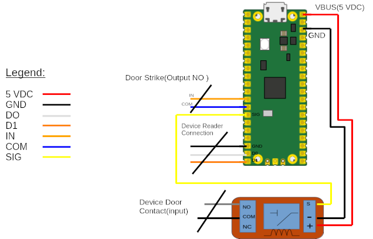

# Wiegand Reader Imitator
### *By: James R Brown*

## Description
Use a Raspberry Pi Pico or Pico 2 to imitate a Wiegand card read or multiple card reads from a reader.  The original script used Micropython to read a text file containing the binary credentials.  These files are generated by another program that was created to generate Wiegand credentials called Wy_Gen.  This can be found here: [Wygen](https://github.com:surferjreb/Wygen.git).  This produces the `cards.txt` file that is read by the script.

The original script just sent the card codes. The project was updated to check if the door strike was fired(Valid Card read/presented) and then activates a relay to activate the door contacts on the door controller or simulate the door opening.

The current version `w_read_byte.py` script was updated to use a `bytearray` instead of a string.  The same `cards.txt` file is read, but now is read in as raw bytes into a `bytearray`.  This improved efficiency in the code.

This script is intended for educational/testing purposes.

> [!NOTE]    
> 
> If the system or door controller that you are connecting too does not use 5 VDC Signal for 485 or reader communications.  You may need to insert a step-up device like a logic level shifter to prevent a failure or damage to the Pico.    

> [!NOTE]  
>
> The devices this was tested on have 5 VDC 485 and use 5 VDC for the signal between readers and controller.  This code has been turned to work with them, adjust to your needs.
---

## Dependencies
> Micropython 3.10

## Device
> Raspberry PI Pico 2040 or Pico 2

---

## Issues
> 
>

---

## Fixes

> Adjusted script to use `bytearray` instead of a `string`.
> Added in Door operation if card is valid in system.  This looks for the system to fire an output in this case the output that would normally activate a strike or deactivate a mag lock.  The Pico then activates a output that acts as a typical door contact on the system, simulating the door being opened.  
> Updated Script to provide error message if `cards.txt` file is not found.

---

## Versions
> 2.0

---

## Instructions

### Tools, Instruments, devices Needed..    

1. RPI Pico 2040 or Pico 2. [RPI Pico](https://www.raspberrypi.com/documentation/microcontrollers/pico-series.html#pico1)
2. Thonny IDE or one of the other ways to load files onto pico.  These instructions cover using Thonny IDE.
3. Micro USB cable to connect pico to pc.
4. A Relay Module. [Used this one](https://arduinomodules.info/ky-019-5v-relay-module/), but any 5 VDC relay will do.  Bought an upgraded version [here](https://www.amazon.com/dp/B095YD3732?ref=ppx_yo2ov_dt_b_fed_asin_title&th=1) worked like a charm.
5. A device to test this on like an Access Control reader controller board.
6. Wire's, many color's if you like.  If you like pain, just wire everything with black...    

> [!NOTE]
> 
> If you don't happen to have an access control system to test this on, this device won't do much for you.  You can, however, make your own...  If you happen to have a Raspberry PI 3b+ or 4, there are some projects out there for creating your own access control system and even kits that include wiegand readers and 26 bit credentials.  Another route is even a Arduino also has a couple boards that have kits.  The Arduino Mega 2560 definitely does have kits available with an Access system example.  Its also a little cheaper than a RPI.  

> [!IMPORTANT]  
>
> This was only tested with 26 bit Wiegand Credentials.  In theory this should with other bit lengths.    

### Steps    

These steps assume that you have already installed thonny IDE and/or have loaded scripts to a pi pico before.  Also, you have a device to test this with, basic knowledge of electrical safety and some wiring skills...

1. If you haven't already, please load Micropython on your PI Pico.  You can find the instructions [here](https://www.raspberrypi.com/documentation/microcontrollers/micropython.html).
2. Open thonny and select the appropriate shell.  You should see some options available in the IDE.
3. Save the script `w_read_byte_2.py` to the Pico.
4. Generate a `cards.txt`, which can be done from my Wiegand Generator utility [Wy_gen](git@github.com:surferjreb/Wygen.git).
5. Save this file to your PICO also. Now your Pico is ready to connect.

#### Wiring Diagram

6. Connect your pico to the system you intend to test on.  You will wire the pico in to where a reader would normally connect its data lines.
7. GP15(D1) => D1.
8. GP14(Dz) => D0.
9. GND to GND of Reader PWR.
10. GP10(SIG) => Sig/IN of Relay.
11. GP09(IN) => to the Door strike output on the access module NO or have the output set to NO.
12. GND(COM) => The common on the Door strike Output relay.
13. VBUS => "+" VDC for Relay.
14. GND => "-" VDC for Relay.
15. NO on Relay => Door contact input for access device.
16. COM on Relay => To Com for Door contact input.

Now, on the access control device, this should be set to read Generic Wiegand 26 bit format.  You may want to add the cards to the system or you will just get a bunch of invalid reads.  You may need to add EOL resistors depending on your systems requirements you are connecting to from the relay to the device input(door contacts) if it has EOL monitoring.

With all that said, plug in the USB to the Pico and you should be getting reads.  If you have Thonny connected or a serial connection to the Pico, you will see the card read to the device, and whether it was a valid read.

> [!IMPORTANT]
>
> Again, if your system uses a 12 VDC for reader data instead of 5 VDC you will damage your Pico probably or the system.  In the very least, it will not read the cards in.  Would recommend a stepping device...
---
